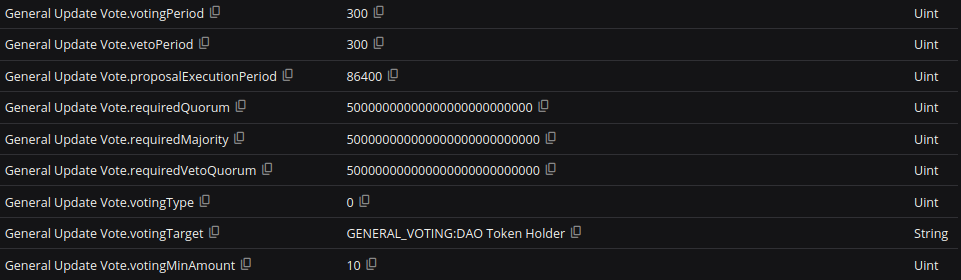

# 📜 Voting process

This describes the voting process within a DAO, where Members or Experts can participate in decision-making by voting on proposals. The types of proposals and their associated settings, such as quorum and majority, can be modified through constitution-parameter voting.&#x20;

To add a user to an Expert Panel (EP), making them eligible to vote on relevant proposals, EP membership voting is employed.

Managing DAO proposals can be done through a native front end.&#x20;


Your tool to participate in the Governance process


#### Voting Power and Weight

* In the case of ERC20 tokens, the number of locked tokens determines the user's voting power.
* In the case of ERC721/ERC5484 tokens, even if a user locks several tokens, their voting power remains one.

#### Voting Types

Three types of voting are available within the system:

1. **Partially Restricted Voting (Type 2)**: Only experts of a certain panel can create voting, but all DAO Token Holders can participate.
2. **Restricted Voting (Type 1)**: Only certain Experts can create proposals, and only other experts can vote for or against them (e.g., Parameter Vote in any Expert Panel by default).
3. **Non-Restricted Voting (Type 0)**: Anyone can create a proposal, and everyone will vote for or against it (e.g., Constitution Votes or Membership Votes in any Expert Panel by default).

The outcome of a proposal depends on the voting/veto quorum and majority, which are specified in the DAO Parameters tab and can be changed by the community.

#### Voting Process

* Users cannot retract or revote their votes.
* In the basic configuration, voting is not anonymous. Everyone can see the votes and voting power of others (e.g., using a blockchain explorer).
* Voting, veto, and execution periods vary between DAOs and can be found in the DAO Parameters tab.
* Tokens are locked when users vote on proposals. Locked tokens counted toward the user's voting power.
* ERC721 token-based DAO locks only one NFT, regardless of how many NFTs the user has deposited.
* ERC5484 token-based DAO cannot lock tokens, but users can neither burn them nor transfer

#### Voting Status

Voting can have different statuses based on user activity and decisions:

1. NONE: If the proposal does not exist.
2. PENDING: If the proposal is in the voting period, it cannot be vetoed during this time.
3. REJECTED: If the quorum or majority was not reached or the experts vetoed the proposal.
4. ACCEPTED: A period when eligible users can veto the proposal.
5. PASSED: If proposal requirements were met and the proposal can be executed.
6. EXECUTED: If the proposal was executed.
7. EXPIRED: If the proposal was not executed after a long period, specified by the relevant parameter.

### Voting Parameters

The DAO Parameters tab in the governance system outlines essential parameters that determine the structure and execution of voting within a DAO.&#x20;


In the case of Expert Panels, they are stored in the Configuration Parameters Storage.&#x20;

In the case of DAO core parameters, they are also stored in the Configuration type Parameter Storage, but are combined with parameters not associated with any of the DAO processes (i.e. constitution.hash).&#x20;

Because any change to any parameter stored as a core DAO parameter will require a change to the constitution hash, so to ensure atomic consistency (changing the configuration and regular parameters in one transaction) they are stored in the same Parameter Storage.


The following format denotes these parameters: `<voting situation name>.<parameter>`.&#x20;

For example, to change the duration (in seconds) of the voting period for a General Update Vote, you would modify the `General Update Vote.votingPeriod` parameter.

The following is a comprehensive explanation of each parameter:

<figure><figcaption>
Base parameters for each voting situation
</figcaption></figure>

1. `votingPeriod`: Specifies the duration (in seconds) of the voting period. In this example, it is set to 300 seconds.
2. `vetoPeriod`: Indicates the duration (in seconds) of the veto period, during which members with veto power can veto a proposal. In this example, it is set to 300 seconds.
3. `proposalExecutionPeriod`: Determines the duration (in seconds) within which a passed proposal can be executed. If not executed during this period, the proposal is marked as Expired. In this example, it is set to 86,400 seconds.
4. `requiredQuorum`: Represents the minimum percentage of voting power needed for a proposal to be considered valid. In this example, it is set to 5% (value: 50000000000000000000000000).
5. `requiredMajority`: Indicates the minimum percentage of voting power needed for a proposal to pass. In this example, it is set to 50% (value: 500000000000000000000000000).
6. `requiredVetoQuorum`: Specifies the minimum percentage of voting power needed for a veto to be successful. In this example, it is set to 50% (value: 500000000000000000000000000).
7. `votingType`: Represents an integer that denotes the type of voting (0 - Non-restricted voting, 1 - Restricted voting, 2 - Partially restricted voting). In this example, it is set to 0.
8. `votingTarget`: A string that specifies the target contract to be called if the proposal passes. In this example, it is set to ${GENERAL\_VOTING\_NAME}:${DAO\_RESERVED\_NAME} (this string represents the deployed GeneralDAOVoting.sol contract).
9. `votingMinAmount`: Indicates the minimum number of tokens a user needs to deposit to create a proposal. In this example, it is set to 10.
   * Be careful if the DAO is based on ERC721 or ERC5484 tokens. This parameter should always be 1 or 0. Otherwise, the DAO will not work properly.

These values can be customized to establish various voting situations within the DAO, enabling flexibility and adaptability as the organization evolves.

### Voting Target structure

The voting target parameter is a string name representing the DAO Registry contract. This name allows you to retrieve the contract from the registry and is composed of two parts, separated by a colon (:) delimiter without spaces.

The first part of the voting target parameter is the contract's general name, such as `DAO_MEMBER_STORAGE`, `DAO_PARAMETER_STORAGE`, `EXPERTS_VOTING`, or `GENERAL_VOTING`.

Following the colon delimiter, the second part of the parameter indicates the contract's ownership or association. Examples include `Bridge Experts`, `DAO Token Holder`, `Uniswap Experts`, and others.

Combining both parts of the voting target parameter creates a unique identifier for a contract within the DAO Registry. For instance:

* `DAO_CONF_PARAMETER_STORAGE:DAO Token Holder` - represents the constitution parameter storage.
* `DAO_MEMBER_STORAGE:Bridge Experts` - represents the member storage for Bridge Experts.
